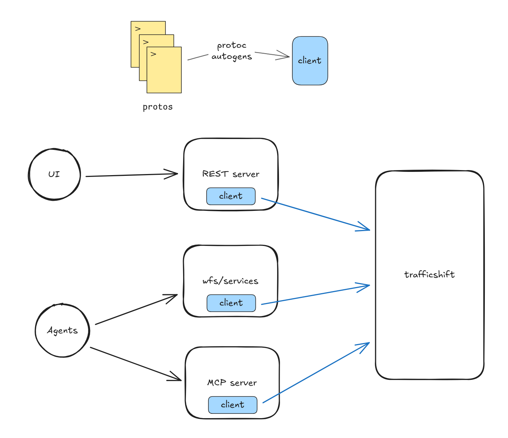

+++
title = "Revolutionizing Accreted Systems"
description = "From incantations to intent"
date = 2026-01-09
+++

I recently came across Bryan Cantrill's talk ["The Complexity of Simplicity"](https://www.youtube.com/watch?v=Cum5uN2634o) in which he categorizes systems based on their complexity, discussing their qualities and risks. This was really insightful as I found he was giving me the language to express my own frustrations with certain systems and motivations for desiring others. So, I'd like to take this newfound lens and apply it to a particular system I have unknowingly been trying to revolutionize for the past couple of months.

First, a brief summary of the talk (and I'm stripping away a lot of nuance here so please go watch it):
* complexity can be **accidental** when abstractions leak across systems or **essential** when they are endemic to a problem
* constructed systems are concerted efforts to tackle essential complexity but are susceptible to scope creep
* rebellious systems are built as a sort of minimalistic, "surely we don't need all this stuff" reaction to constructed systems
* accreted systems are ones which accumulate tech debt or suffer from poor/unprincipled maintenance
* revolutionary systems are "clean sheet of paper" attempts to innovate on a problem by finding an elegant abstraction

---
## Web of Complexity
I've spent the majority of the past 5 years thinking about automating various operational processes in Azure's network. We detect undesired signals in the network and then perform a series of operational tasks to:
1. prevent this undesired signal from negatively impacting customers and
2. mitigate the underlying issue and restore the network

However, we rarely need to perform *just* the core operational task. For example, we can't just restart a router or drain traffic from an optical span. Most tasks come with some pre-checks and post-checks to perform, requirements that we update a database so other systems are aware of our actions, and maybe some tickets we need to create for auditing or escalation. There is good reason for most of this additional process, but as this complexity leaks, we force automating services to perform many ritualistic incantations to solve a problem end-to-end. Worse yet, as more services try interfacing with this process, it becomes increasingly burdensome to add new layers or change existing layers correctly.

The particular process I've been dealing with recently is related to how we drain traffic off optical spans. For various reasons, spans can "degrade" and, if severe enough, impact customer traffic. To protect customer packets from traveling over this degraded span, we can drain traffic, shifting it onto a redundant path through the network. Technicians can then repair the span and traffic can be shifted back. So, the core operational task is shifting traffic on and off spans, but some of the layers of complexity are:
* include the span's associated path in the request, which you can find by joining some Kusto tables together. Oh, and make sure you use the DeviceStatic table not the Devices table because sometimes the Devices table is dropped (by design)
* make your request by ingesting data into a different Kusto table - another service polls it and will service your request
* your request will take an indeterminable amount of time to take effect - use another query to track its status
* once traffic is drained, you'll find a ticket in your queue. Please leave the ticket there and only mitigate it when you want to shift traffic back - this ticket *is* your API

Complexity has certainly leaked to the requestor of the operational task. No single system contains all of this complexity, so interested parties must learn the song and dance for themselves. This process is then independently reimplemented by each system that needs it and any changes required to maintain correctness (we're going to use a different database now) are externalized to consumers.

How did we get here? Well, no one person wove this web and I want to emphasize this isn't a finger-pointing exercise. It's easy for the web to grow as original intents become obfuscated, temporary hotfixes calcify, and vestigial processes are kept around either out of concern for breaking things or because something else was simply more pressing. Over time, one task became a graph of fractured and siloed systems. Once this web is in place, it's almost always easier to adapt an existing system to satisfy new requirements than build something new. As Bryan points out, accreted systems work *well enough*, so the value calculation weighs heavily in favor of just digging the hole a little bit deeper - after all, you can still reach the ladder from here.

---
## Contain Complexity; Expose Intent
No single API exists to satisfy the operational tasks of shifting traffic on and off spans. Any service wishing to perform these operations must know details about the underlying ticketing systems and databases involved in the process. Complexity has leaked to the detriment of clients, so we must contain it. First, it's important to understand and document everything that must be done to satisfy "correctness" for the current state of the process. This means talking with stakeholders across teams to understand ownership boundaries and which side-effects actually matter so we can contain the extent of the leakage. It's also important to do a bit of technological archaeology to understand if the facets of complexity are **accidental** or **essential**. If you're lucky, historical decisions were documented and you have access to the OneNote or Sharepoint or internal Wiki or Loop page where the documentation lives. If you're unlucky, you will have to hope that tribal knowledge has survived attrition and human forgetfulness. 

Containing the complexity has been pretty straightforward in the case of shifting traffic. We have created a trafficshift microservice (yes, I'm great at naming things), powered by [Temporal](https://temporal.io/)'s durable execution framework, which expresses all the complexity as workflows that interact with one another. The new service owns all the implementation details related to databases, auditing, and ticketing. Now instead of re-enacting the traffic shift song and dance, clients can perform the desired operational task with **intent-based APIs**. Simple CRUD operations look like submitting a trafficshift request, querying the status of your request, or signaling that a drain can be reverted. We use a [protoc plugin](https://github.com/cludden/protoc-gen-go-temporal) to generate a client (among other things) for this service so we can create a number of interfaces for different use cases, and they all get the same ergonomic API.

Now, when a service needs to perform traffic shifts, the code reads in alignment with the intent ("I want to request traffic drain for this span, so I call the DrainTraffic API and poll using the GetTrafficStatus API") instead of reading as a translation of the full process ("I have to read from this table, then ingest some data, then poll a ticket until it's in the Active state"). Making changes is radically simple as well since we implement and rollout the changes in a single service. Clients everywhere are unchanged while the microservice executes the new process on their behalf. 

---
## Why This Matters More Now
When you hear "automating operational processes," an opportunity that comes to mind is likely LLM integration. We have spent a few years tinkering with various agentic services that seek to unburden engineers from operational load. I won't go into those projects here, but one thing we have experienced is an agent's ability to carry out some task is weak when it is operating within an accreted system. And I don't blame the technology - if you gave me a system prompt and our internal APIs, I probably couldn't `curl` everything in the right order with the right payloads either. Maybe you can plop an agent into an accreted system and invest in better prompts or advanced agentic systems like planning, memory management, and agent handoffs; however, this just further externalizes the complexity. 

If we want to enable effective agentic operations, we have to shift our systems to the right. An intent-based API is better to work with whether it's consumed by an external service via REST or consumed by an agent via MCP. The funny part of this is we grapple with whether it's worth simplifying complexity for ourselves but if you tell leadership it's needed to enable agentic workloads - green light!

---
## Is this a Revolution or a Rebellion
Bryan's taxonomy outlines both revolutionary and rebellious systems. I was eager to label what I want to carry out as "revolutionary" - maybe I hold my intentions in too high regard. Looking back at the qualities ascribed to the different types of systems, I do see qualities of both in what I'm building. There is both the rejection of what came before and the concerted effort to innovate on the abstraction. Importantly for me, I now have a better framework and more precise language for reasoning about systems which I can apply to the rest of this endeavor and others going forward.

Ultimately, "turn a decentralized process into a microservice" is not a revolutionary suggestion. But the revolution isn't in *how* we implement something; it's in *why* we implement it - we want to provide an intent-based API that "[sparks joy](https://konmari.com/marie-kondo-rules-of-tidying-sparks-joy/?srsltid=AfmBOoqwHLhW_yV3Zorbrp14-kJMrGbi_0qjk83QzqX_MUnFmiGIpj-A)."
